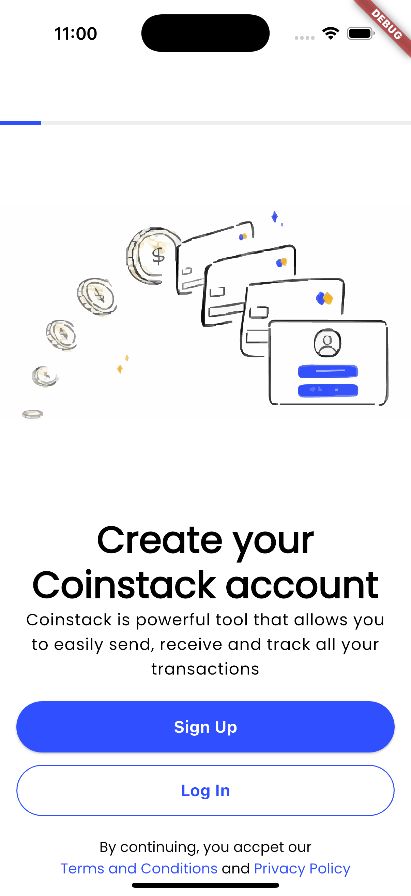
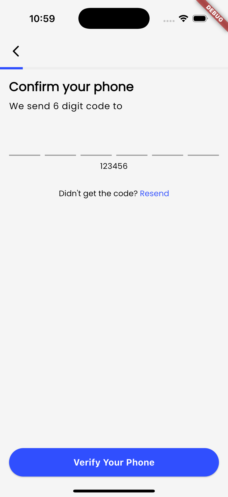
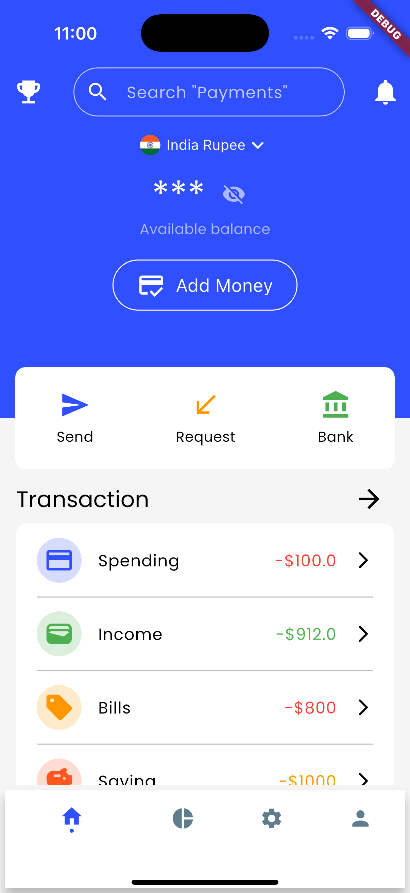
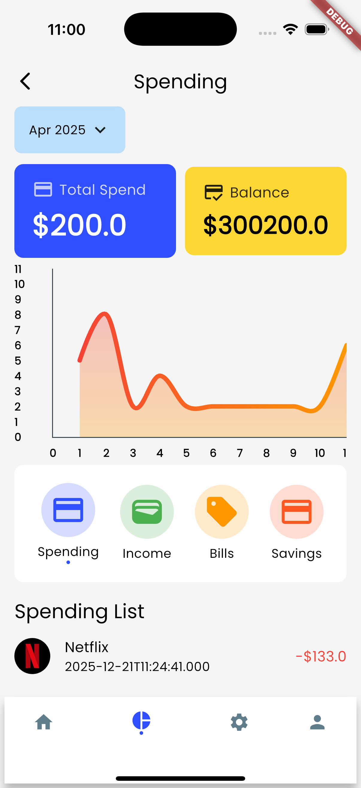
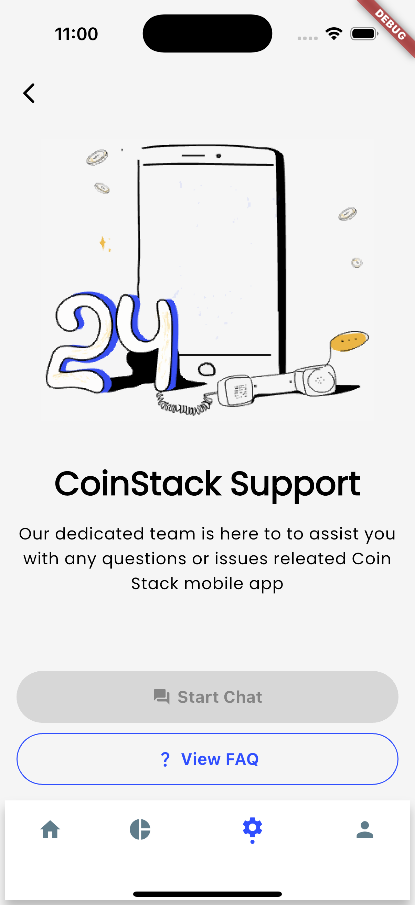
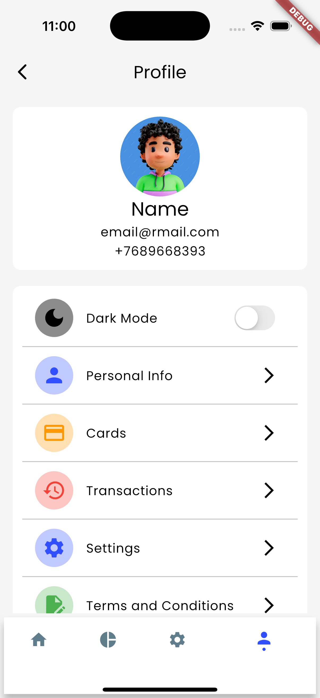

# Coin Stack

Coin Stack is a modern, secure fintech mobile application built using Flutter. The app is designed with a clean architecture approach, ensuring scalability, maintainability, and separation of concerns across its feature set.

## 🚀 Features

- Follows **Clean Architecture**: Divides the app into presentation, domain, and data layers for a scalable and testable codebase with my own touch suitable for this project.
- Built with **Flutter** for high performance and cross-platform support.
- Utilizes a professional, user-friendly UI from a publicly available Figma community design.
- Includes a complete user flow for a finance-focused application, from onboarding to transaction handling.

## 📱 UI/UX Design

All UI designs used in this project are based on the [Coinpay Fintech Finance Mobile App UI Kit](https://www.figma.com/community/file/1195417779279692347/coinpay-fintech-finance-mobile-app-ui-kit-community) by the original creator on Figma Community.  
**All copyrights and design credits belong to the original Figma creator.**

## 🧱 App Structure

Coin Stack implements Clean Architecture using the following layer separation:

- **Presentation Layer**: Widgets, screens, and UI logic.
- **Domain Layer**: Use cases and model.
- **Data Layer**: Repositories (API, local DB, etc).

## 📄 Screens

The application consists of the following 16 screens:

1. Splash  
2. Onboarding  
3. Registration  
4. Account Setup  
5. Account Verification  
6. Pin Setup  
7. Welcome  
8. Login  
9. Adding Card  
10. Homepage  
11. Send  
12. Receive  
13. Profile  
14. Support  
15. Transaction  
16. 404 (Error Page)

## 🛠️ Getting Started

### Prerequisites

- Flutter SDK: [Install Flutter](https://flutter.dev/docs/get-started/install)
- Dart SDK
- Android Studio or VS Code (recommended)

### Installation

1. **Clone the repository**:

   `git clone https://github.com/yourusername/coinstack.git`
   `cd coinstack`

2. **Get dependencies**:
    
    `flutter pub get`

3. **Run the app**:

    `flutter run`

📂 Folder Structure

lib/
    ├── core/      # Common utilities, theme, and constants
    ├── feature
    ├       ├── data/     # Data sources, models, and repositories
    ├       ├── domain/    # Entities and use cases
    ├       ├── presentation/      # UI screens and widgets
    ├                  ├── screens/
    ├                  └── widgets/
    └── main.dart

📸 Some Screenshots

<!-- 

 -->

📜 License
This project is for educational and non-commercial use. UI design copyrights belong to the original Figma creator.